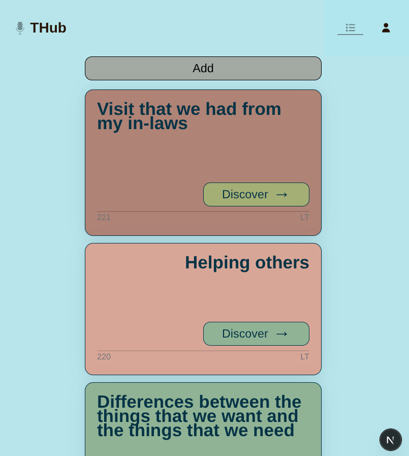

# ПРОЕКТ TranscriptoHub

## ПРЕДНАЗНАЧЕНИЕ:

Хранилище транскрипций англоязычных подкастов. Пользователь может добавлять записи и использовать их при прослушивании подкаста.

## ВОЗМОЖНОСТИ

Реализована авторизация и хранение пользовательских записей с помощью Prisma.

## СТЭК

- Next.js (SSR для страниц с подкастами и клиентские компоненты для интерактивности), серверные экшены,
- Tailwind для стилизации,
- Auth.js для авторизации,
- HeroUI как базовый набор компонентов,
- Prisma ORM для работы c базой данных,
- Zustand для глобального стейта,
- Zod для валидации.

## ДЕПЛОЙ по ссылке:

[TranscriptoHub](https://transcripto-hub.vercel.app/)
